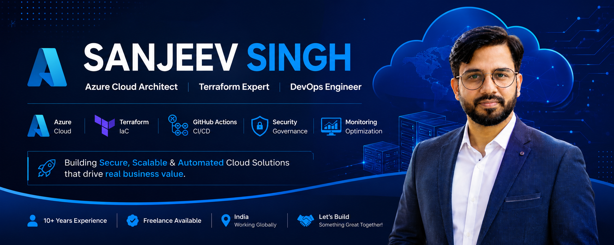
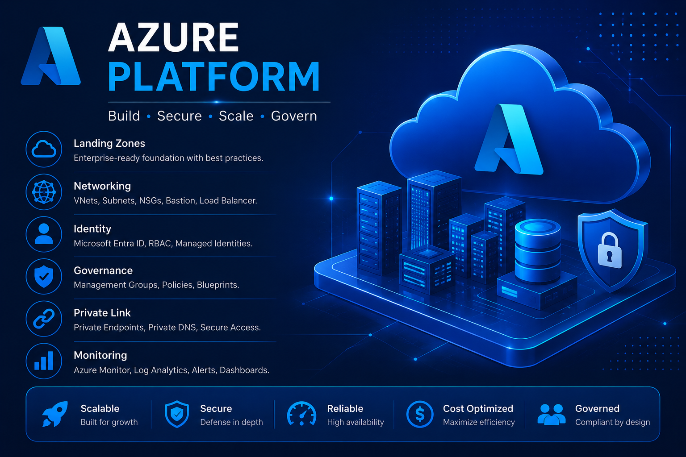
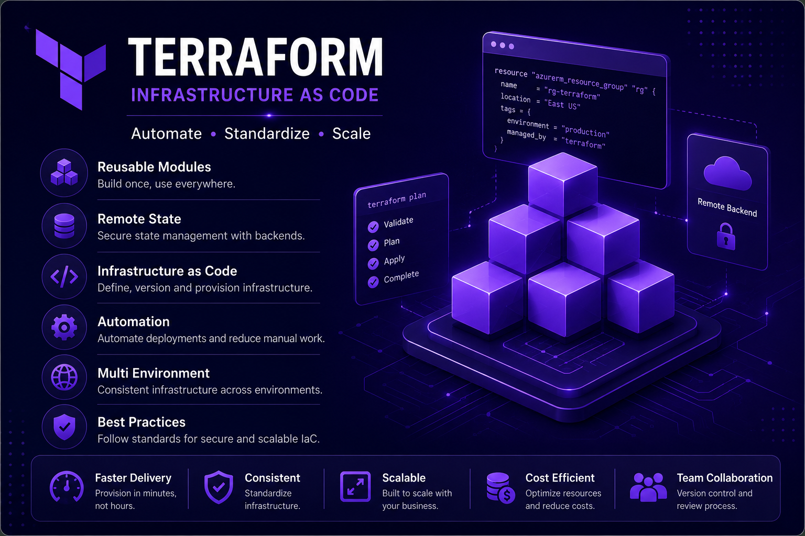
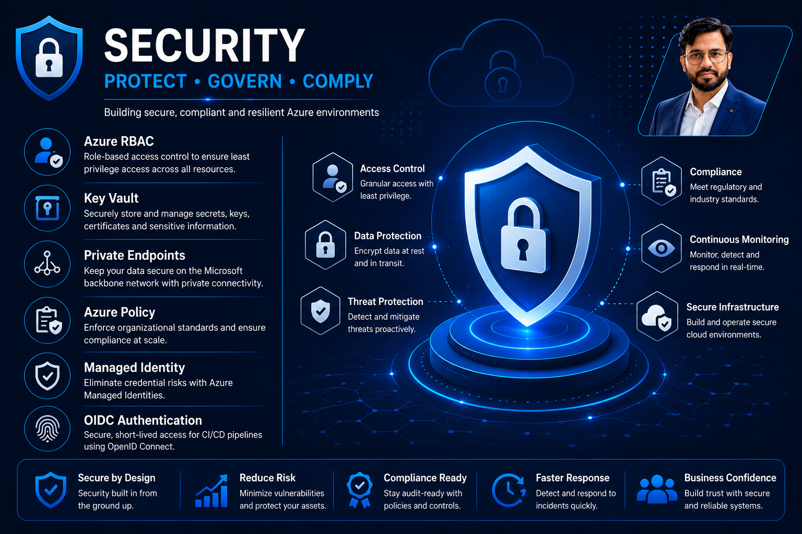
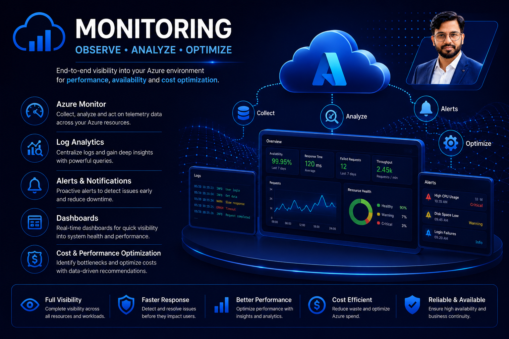
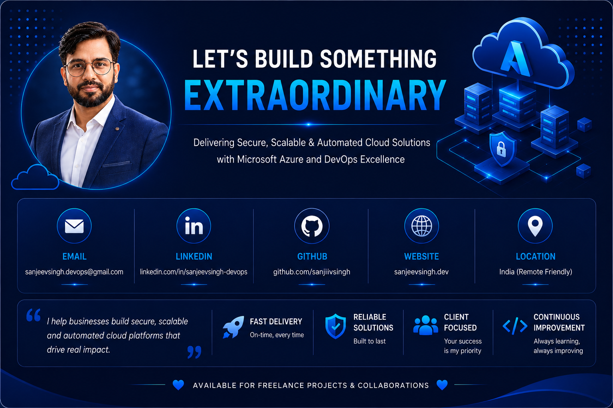

 

# Sanjeev Singh

### Azure Cloud Architect • Terraform Expert • DevOps Engineer • Freelance Cloud Consultant

---

# Helping Businesses Build Secure Azure Cloud Platforms

I help startups, growing businesses, and enterprise teams design, automate, and optimize Microsoft Azure environments using Infrastructure as Code and modern DevOps practices.

My focus is delivering **secure**, **scalable**, and **production-ready** cloud platforms that reduce manual effort, improve governance, and accelerate software delivery.

Whether you're implementing Azure Landing Zones, adopting Terraform, automating deployments with GitHub Actions, or modernizing existing infrastructure, I can help transform cloud operations into a repeatable and reliable engineering process.

---

# What I Deliver

| Solution                  | Business Value                                 |
| ------------------------- | ---------------------------------------------- |
| ☁ Azure Landing Zones     | Build enterprise-ready Azure foundations       |
| 🏗 Infrastructure as Code | Consistent, reusable Terraform deployments     |
| 🚀 GitHub Actions         | Faster and safer CI/CD pipelines               |
| 🔒 Cloud Security         | Secure-by-default Azure environments           |
| 🌐 Cloud Networking       | Reliable and scalable connectivity             |
| 📊 Monitoring             | Improved visibility and operational excellence |
| 💰 Cost Optimization      | Reduce Azure operational costs                 |

---

# Azure Platform Engineering

Enterprise-ready Azure environments built around Landing Zones, governance, networking, identity, security, monitoring, and operational excellence.

---

# Terraform Infrastructure as Code

Build repeatable, reusable, and production-ready cloud infrastructure using Terraform modules, remote state management, automation, and environment standardization.

---

# DevOps & Continuous Delivery

Automate software delivery using GitHub Actions, OIDC authentication, deployment pipelines, validation workflows, and release automation.

---

# Cloud Security & Governance

Security is integrated into every stage of the cloud lifecycle—not added later. I implement Azure security best practices that protect workloads while maintaining operational efficiency.

### Key Focus Areas

- Azure RBAC & Least Privilege Access
- Microsoft Entra ID Integration
- Managed Identities
- Azure Key Vault
- Azure Policy & Governance
- Private Endpoints
- Zero Trust Architecture
- Secure Infrastructure Design

---

# Monitoring & Operational Excellence

Reliable cloud platforms require continuous visibility. I build monitoring solutions that provide actionable insights into infrastructure health, performance, availability, and operational costs.

### Monitoring Services

- Azure Monitor
- Log Analytics
- Alerts & Action Groups
- Resource Diagnostics
- Performance Optimization
- Cost Analysis
- Operational Dashboards
- Infrastructure Health Monitoring

---

# Cloud Delivery Workflow

Every successful cloud project follows a structured engineering process. My delivery approach ensures consistency, security, and repeatability from planning through production.

---

# Core Technology Stack

  

**Microsoft Azure • Terraform • GitHub Actions • Docker • Linux • Bash • PowerShell • VS Code**

---

# Core Expertise

| Domain | Expertise |
|---------|-----------|
| ☁ Cloud Architecture | Microsoft Azure |
| 🏗 Infrastructure as Code | Terraform |
| 🚀 DevOps | GitHub Actions |
| 🔒 Cloud Security | Azure RBAC · Key Vault · Policies |
| 🌐 Networking | VNets · NSGs · Bastion · Private Link |
| 📊 Monitoring | Azure Monitor · Log Analytics |
| ⚙ Automation | Bash · PowerShell |
| 📦 Containers | Docker |

---

# Featured Project

## 🌟 Terraform Azure Foundation

This repository represents my approach to building reusable, production-ready Azure infrastructure with Terraform.

### Highlights

- Modular Terraform Architecture
- Azure Landing Zone Concepts
- Environment Separation
- GitHub Actions CI/CD
- Infrastructure as Code Best Practices
- Reusable Azure Modules
- Enterprise-Ready Folder Structure

> **Objective:** Build a scalable Terraform foundation that organizations can extend for development, testing, and production environments.

---

# GitHub Analytics

  

---

# Why Organizations Work With Me

Building cloud infrastructure is more than deploying Azure resources. My goal is to help organizations establish secure, scalable, and maintainable cloud platforms that accelerate development while reducing operational complexity.

## What You Can Expect

| ✔ Technical Excellence | ✔ Business Outcomes |
|------------------------|--------------------|
| Azure Landing Zone Architecture | Faster Cloud Adoption |
| Enterprise Terraform Modules | Reduced Deployment Time |
| GitHub Actions Automation | Lower Operational Costs |
| Secure Cloud Architecture | Improved Reliability |
| Azure Governance & Policies | Better Compliance |
| Production-Ready Infrastructure | Long-Term Maintainability |
| Infrastructure Documentation | Knowledge Transfer |
| DevOps Best Practices | Scalable Engineering Standards |

---

# Professional Services

| ☁ Azure Cloud | 🏗 Infrastructure as Code | 🚀 DevOps |
|---------------|---------------------------|-----------|
| Azure Landing Zones | Terraform Modules | GitHub Actions |
| Azure Networking | Remote State | CI/CD Pipelines |
| Azure Governance | Multi-Environment Deployments | OIDC Authentication |
| Azure Security | Infrastructure Automation | Release Automation |

 

| 🔒 Security | 📊 Operations | 🤝 Consulting |
|-------------|--------------|---------------|
| RBAC | Azure Monitor | Cloud Architecture |
| Key Vault | Log Analytics | Infrastructure Review |
| Azure Policy | Alerting | Cost Optimization |
| Private Endpoints | Diagnostics | Technical Mentoring |

---

# Engagement Models

Whether you need a complete Azure implementation or support for an existing environment, I can help with:

- Azure Platform Architecture
- Azure Landing Zone Implementation
- Terraform Infrastructure Development
- GitHub Actions CI/CD Pipelines
- Infrastructure Modernization
- Cloud Governance
- Security Reviews
- DevOps Consulting
- Long-Term Cloud Support

---

# Currently Building

I believe the best way to demonstrate expertise is by building real-world solutions.

### Current Focus

- Enterprise Azure Landing Zones
- Terraform Azure Foundation
- Reusable Azure Modules
- GitHub Actions Automation
- Cloud Governance
- Infrastructure Best Practices
- Platform Engineering

---

# Let's Connect

If you're looking for someone who can design, automate, and optimize Microsoft Azure infrastructure using modern DevOps practices, I'd be happy to discuss your project.

---

---

### Building Reliable Azure Platforms Through Automation, Security & Infrastructure as Code

 

